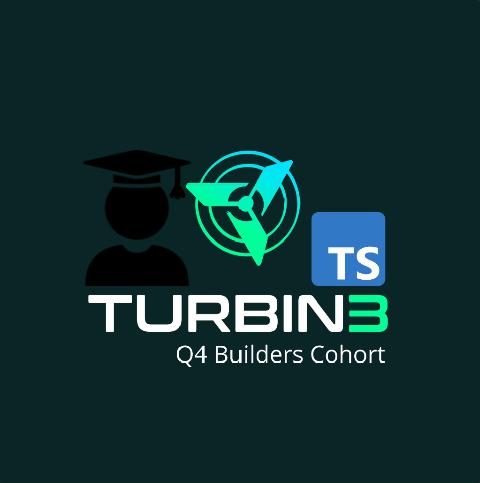

# 🚀 Turbin Prereq Q4 2025

A comprehensive Solana development toolkit featuring both **TypeScript** and **Rust** implementations for airdrop operations, wallet management, and blockchain interactions.

## 📋 Table of Contents

- [🎯 Overview](#-overview)
- [✨ Features](#-features)
- [🏗️ Project Structure](#️-project-structure)
- [🚀 Quick Start](#-quick-start)
- [📱 Screenshots](#-screenshots)
- [🔗 Transaction Links](#-transaction-links)
- [🛠️ Available Scripts](#️-available-scripts)
- [📦 Dependencies](#-dependencies)
- [🔧 Setup Instructions](#-setup-instructions)

## 🎯 Overview

This project demonstrates Solana blockchain development using both TypeScript and Rust, showcasing:
- **Airdrop operations** for token distribution
- **Wallet management** and key generation
- **Transaction handling** with proper fee calculation
- **Cross-language compatibility** between TS and Rust implementations

## ✨ Features

### 🔥 Core Functionality
- **Airdrop System**: Distribute tokens to multiple addresses
- **Wallet Operations**: Generate, convert, and manage Solana wallets
- **Transaction Management**: Send SOL with automatic fee calculation
- **Drain Operations**: Transfer all funds from a wallet
- **Enrollment System**: Register addresses in the airdrop program

### 🛡️ Safety Features
- **Fee Calculation**: Automatic network fee estimation
- **Balance Validation**: Prevents insufficient fund transactions
- **Error Handling**: Comprehensive error management
- **Type Safety**: Full TypeScript support with strict typing

## 🏗️ Project Structure

```
Turbin_prereq_1_Q4_2025/
├── 📁 airdrop/           # TypeScript implementation
│   ├── 🎯 Core Scripts
│   │   ├── airdrop.ts    # Main airdrop functionality
│   │   ├── transfer.ts   # SOL transfer operations
│   │   ├── drain.ts      # Wallet draining utility
│   │   ├── enroll.ts     # Address enrollment
│   │   └── keygen.ts     # Keypair generation
│   ├── 🔧 Utilities
│   │   ├── convert.ts    # Base58 to bytes conversion
│   │   └── scripts/      # Additional tooling
│   ├── 📦 package.json   # Node.js dependencies
│   └── 🖼️ assets/        # Screenshots and images
├── 📁 airdrop2/          # Rust implementation
│   ├── 🦀 src/lib.rs     # Rust core logic
│   ├── 📦 Cargo.toml     # Rust dependencies
│   └── 🎯 target/        # Build artifacts
└── 📄 README.md          # This file
```

## 🚀 Quick Start

### Prerequisites
- **Node.js** (v18+) and **Yarn** package manager
- **Rust** toolchain (latest stable)
- **Solana CLI** tools
- **Devnet SOL** for testing

### Installation

1. **Clone the repository**
   ```bash
   git clone <your-repo-url>
   cd Turbin_prereq_1_Q4_2025
   ```

2. **Setup TypeScript environment**
   ```bash
   cd airdrop
   yarn install
   ```

3. **Setup Rust environment**
   ```bash
   cd ../airdrop2
   cargo build
   ```

## 📱 Screenshots

<p align="center">
  
  
</p>

*TypeScript (left) and Rust (right) implementations in action*

## 🔗 Transaction Links

### ✅ Completed Transactions

| Operation | TypeScript | Rust |
|-----------|------------|------|
| **Initialize** | [🔗 View Transaction](https://explorer.solana.com/tx/9RzWPx92QqFRJ5BMLDUNf8Mua4S3JX6EuxW2x1rKkPLGk2WuuL2S8JBjgg8ofmUhB4QyYLuHs6jTZZfXMHivecC?cluster=devnet) | - |
| **Submit TS** | [🔗 View Transaction](https://explorer.solana.com/tx/2HF23XB9UFfRJyBQa6NwuZ63vkKCXP7DenswgmwcPaeWaYsxjkeWwbU5HBKRwbJnEX5JY5T79rWP5mjGd2GKDXmq?cluster=devnet) | - |
| **Submit Rust** | - | [🔗 View Transaction](https://explorer.solana.com/tx/5FkxssHcvmcAFGnZz1GACUMchet8uRw99QbZeprmLxAz6WKZPtYpefzR3MboY5QphHA8Fqmfi4b7JH9fmWA2ZQ4o?cluster=devnet) |

## 🛠️ Available Scripts

### TypeScript Scripts (`airdrop/`)

```bash
# Wallet Management
yarn keygen          # Generate new keypair
yarn convert         # Convert base58 to wallet format

# Blockchain Operations  
yarn airdrop         # Execute airdrop distribution
yarn transfer        # Send SOL transfer
yarn drain           # Drain wallet completely
yarn enroll          # Enroll address in program

# Development
yarn generate-client # Generate TypeScript client
```

### Rust Scripts (`airdrop2/`)

```bash
# Build and run
cargo build          # Compile Rust project
cargo run            # Execute Rust implementation
cargo test           # Run tests
```

## 📦 Dependencies

### TypeScript Stack
- **@solana/web3.js**: Core Solana JavaScript SDK
- **@solana/kit**: Enhanced Solana utilities
- **bs58**: Base58 encoding/decoding
- **typescript**: Type safety and compilation
- **tsx**: TypeScript execution

### Rust Stack
- **solana-sdk**: Core Solana Rust SDK
- **solana-client**: Solana RPC client
- **solana-program**: Program development tools
- **bs58**: Base58 encoding/decoding

## 🔧 Setup Instructions

### 1. Environment Configuration

Create your wallet files:
```bash
# Generate new wallet
yarn keygen

# Or convert existing Phantom wallet
yarn convert
# Paste your base58 secret key when prompted
```

### 2. Fund Your Wallet

Get devnet SOL from the Solana faucet:
```bash
solana airdrop 2 <YOUR_WALLET_ADDRESS> --url devnet
```

### 3. Run Operations

```bash
# Execute airdrop
yarn airdrop

# Send transfer
yarn transfer

# Drain wallet
yarn drain
```

## 🎯 Use Cases

- **Token Airdrops**: Distribute tokens to community members
- **Wallet Management**: Generate and manage multiple wallets
- **Fund Distribution**: Automated SOL transfers
- **Testing**: Devnet operations for development
- **Education**: Learn Solana development patterns

## 🤝 Contributing

1. Fork the repository
2. Create a feature branch (`git checkout -b feature/amazing-feature`)
3. Commit your changes (`git commit -m 'Add amazing feature'`)
4. Push to the branch (`git push origin feature/amazing-feature`)
5. Open a Pull Request

## 📄 License

This project is licensed under the MIT License - see the [LICENSE](LICENSE) file for details.

## 🔗 Links

- [Solana Documentation](https://docs.solana.com/)
- [Solana Devnet Explorer](https://explorer.solana.com/?cluster=devnet)
- [Solana Web3.js](https://solana-labs.github.io/solana-web3.js/)
- [Rust Solana SDK](https://docs.rs/solana-sdk/)

---

<p align="center">
  <strong>Built with ❤️ for the Solana ecosystem</strong>
</p>